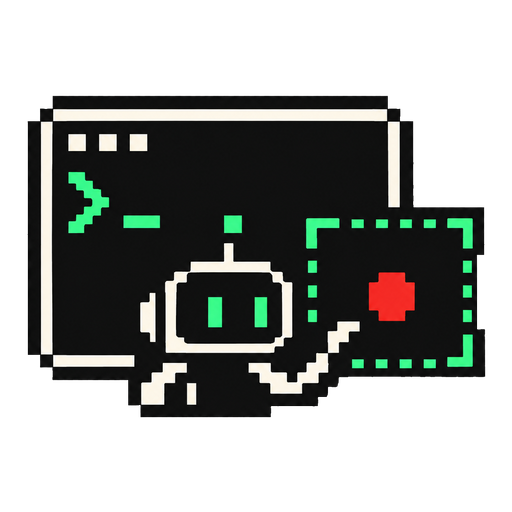
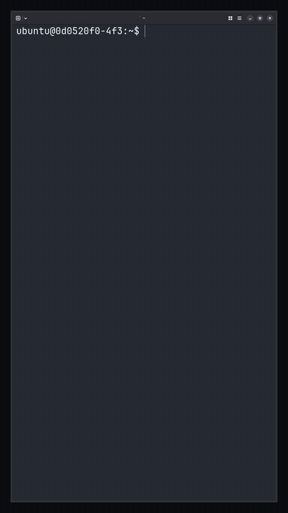

<p align="center">
  
</p>

<h1 align="center">agentcam</h1>

<p align="center"><b>Your agent films its own demo.</b></p>

<p align="center">
  A screen recorder for agents in headless Linux microVMs and on macOS.<br>
  It runs the terminal or app, drives it, and cuts the video for 16:9 and 9:16.
</p>

<p align="center">
  
  
  
  <a href="LICENSE"></a>
</p>

<p align="center">
  
  <br>
  <sub>Ghostty in a Vercel Sandbox, typed, clicked and filmed by <code>agentcam</code>. The pointer only shows up for the click.</sub>
</p>

---

Your agent just built a TUI, a Claude Code mod, or a CLI, and now someone needs to see it. So you open a screen recorder, run the thing yourself, fumble a keystroke, trim the dead air in an editor, and crop it to vertical for social. Meanwhile the agent that built it is running in a Firecracker VM with no screen, no GPU, and no way to show you anything but text.

With agentcam, the agent records it. It starts the program inside a terminal or virtual display that agentcam owns, types and clicks through the demo, waits for the screen instead of guessing sleeps, and stops. Then `agentcam export --layout 9:16 --tighten --upload blob` cuts the pauses, fills the vertical frame, and hands back a URL before the VM disappears.

Every command prints one JSON object, so the agent always knows what happened.

## Get started

Install the binary. It's one static file for Linux (x86_64, arm64) or macOS:

```sh
curl -fsSL https://raw.githubusercontent.com/davekiss/agentcam/main/install.sh | sh
```

Export needs `ffmpeg`, and the x11 source also needs `Xvfb` (`apt-get install -y ffmpeg xvfb`). Then:

```sh
agentcam doctor                                # what's available, what's missing
agentcam start --tty --for 9:16 -- htop
agentcam wait --idle 1
agentcam key q
take=$(agentcam stop | jq -r .id)
agentcam export "$take" --layout 9:16
```

### Teach your agent

The agentcam skill tells an agent how to plan a take, drive it, export it, and check the result before handing it over. In Claude Code:

```
/plugin install agentcam --marketplace davekiss/agentcam
```

For other agents, point them at [skills/agentcam/SKILL.md](skills/agentcam/SKILL.md) or paste it into your `AGENTS.md`.

### Build from source

With Rust installed. On Linux, the musl target gives one static binary:

```sh
cd portable
cargo build --release --target x86_64-unknown-linux-musl
cp target/x86_64-unknown-linux-musl/release/agentcam ~/.local/bin/agentcam
```

## What it's good at

### It records terminals without a screen

The `tty` source runs the program in a pseudo-terminal that agentcam owns and records its output stream with timestamps, in [asciicast v2](https://docs.asciinema.org/manual/asciicast/v2/). No display, no GPU, and almost no CPU: a short shell session with an `ls` comes to about 1.4 KB. Export replays the stream through a terminal emulator and draws it in JetBrains Mono, with fallback fonts for symbols, box drawing and braille spinners.

```sh
agentcam start --tty --for 9:16 -- claude
```

> *"Record a demo of the herdr pane layout."* · *"Film the `/auto-mode-setup` flow, vertical."* · *"Make a 20-second clip of the CLI's --help and one real run."*

### It records real apps on a virtual display

The `x11` source starts Xvfb, launches your app on it, sizes the window to fill the screen (there's no window manager), and captures with ffmpeg. Anything that draws to X11 works; it's tested with Ghostty, xterm and xmessage. On a 4-vCPU Vercel Sandbox, capture costs about 80% of one core for ffmpeg and 5% for Xvfb.

```sh
agentcam start --x11 --for 9:16 -- ghostty --font-size=26
```

### It drives what it records

The agent works the program through agentcam, and every input lands in `timeline.json` with its exact time:

```sh
agentcam type 'echo hello'          # human-paced typing; works for é and ✔ on x11 too
agentcam key ctrl+c
agentcam click 500 900              # x11
agentcam wait --text 'Looks good'   # block until the screen matches
agentcam wait --new --text 'ok'     # match only output since the last input
agentcam wait --idle 1              # block until the screen settles
agentcam screen                     # what's on screen now, as text (tty) or PNG (x11)
```

`agentcam wait` replaces guessed sleeps, so a take paces itself on the app instead of on the agent's think time.

### It fills a vertical frame

9:16 exports always fill the frame. `--for 9:16` records at a size that maps onto the portrait canvas exactly: a 53x45 grid for tty, a 1000x1840 screen for x11. A wide take gets a camera that pans across it, following the cursor, the text that just changed, or the mouse, on a damped spring with a dead zone so it doesn't jitter.

### It cuts its own dead air

`--tighten` retimes a tty take from its own data. Typing plays at 1x, a busy spinner shrinks to about 2 seconds, and a settled screen holds for a reading time before cutting to just before the next input. A 3-minute take of Claude Code's `/auto-mode-setup` came out at 38 seconds with every step visible.

For judgment calls, `portable/scripts/jev_tighten.py` edits the cut with [TypeSafe](https://typesafe.ai) Jev: important screens hold longer, boilerplate gets less, and mistakes that were undone are cut. In blind tests against three editor models, on takes it wasn't tuned on, it landed 38% closer to the editors' hold times than plain tighten, for about $0.0005 a take.

```sh
agentcam export <take> --tighten --plan-out plan.json
python3 portable/scripts/jev_tighten.py plan.json --purpose "Setting up auto mode" --out plan.jev.json
agentcam export <take> --layout 9:16 --plan plan.jev.json
```

### It shows the pointer only when it matters

The x11 recording has no pointer baked in. Pointer positions and clicks go into the timeline, and export draws them back: hidden while the agent types, faded in when the mouse moves, with a ripple on each click. `--cursor always` and `--cursor never` are there when you want them.

### It checks its own work

Every export reviews itself. The JSON says how much changed each second, where nothing moved, and whether the video is blank or frozen, and a contact sheet lands next to the MP4 with a labelled frame every second or so. The agent can look at one PNG instead of trusting a file it never watched. A video that fails review is never uploaded: `--upload` refuses with `review_failed` and names the sheet to look at.

```sh
agentcam review export-9x16.mp4 --at 12   # check any MP4 again, and pull the frame at 12s
```

### It delivers before the VM disappears

`--upload blob` puts each export in Vercel Blob (`blob:private` for private stores) and adds its URL to the JSON. Any `https://` URL works as a presigned PUT, which covers S3, R2, GCS and Mux direct uploads.

> *"Export it vertical and upload it."* · *"Give me a link I can watch."*

## Commands

| Command | What it does |
| --- | --- |
| `agentcam start --tty [--size CxR \| --for 9:16] -- cmd` | Run `cmd` in a recorded terminal; returns once recording |
| `agentcam start --x11 [--size WxH \| --for 9:16] [-- cmd]` | Start a virtual display, launch `cmd` on it, record; returns the display |
| `agentcam type` / `key` / `click` / `move` | Drive the program; each input is logged with its time |
| `agentcam wait --text RE [--new]` / `--idle S` | Block until the screen matches, or settles |
| `agentcam screen [--png PATH]` | What's on screen now |
| `agentcam mark LABEL` | Drop a marker on the take clock |
| `agentcam status` / `stop` | Check on the take, or finish it and print take.json |
| `agentcam export TAKE` | Compose 16:9 and 9:16 MP4s, each reviewed with a contact sheet; `--tighten`, `--plan`, `--border`, `--cursor`, `--upload` |
| `agentcam review FILE.mp4 \| TAKE [--at T]` | Review an MP4 again: activity, idle spans, checks, a contact sheet, and stills |
| `agentcam doctor` / `sources` | What this machine can record, and what's missing |

Failures print `{"error": {"code", "message"}}` and exit nonzero. [SPEC.md](SPEC.md) has every flag and JSON shape.

## The take folder

```
take.json        source, tracks, per-track sync offsets, status
term.cast        tty: the terminal output stream
screen.mp4       x11: H.264 capture, no pointer
timeline.json    typed text, keys, clicks, pointer samples, markers
markers.jsonl    markers added while recording
recorder.log     the background recorder's output
export-16x9.mp4  written by agentcam export
export-9x16.mp4
export-9x16.sheet.png  the export's contact sheet, one frame every second or so
```

Takes go to `~/.local/share/agentcam/` on Linux and `~/Movies/agentcam/` on macOS unless `--out` says otherwise. Recording and composing are separate, so one take exports to every layout, and an agent can fix sync or timing by editing the JSON.

## Limits

- `--tighten` and `agentcam wait --text` work on tty takes only. x11 needs pixel-diff tightening and OCR, which aren't built yet.
- A tty grid is fixed at record time, so record with `--for 9:16` when you want vertical video. A wide take exported to 9:16 crops to a panning window.
- The x11 pointer is drawn as a standard arrow, not the app's own cursor shape.
- Only the app agentcam launches is sized to fill the screen. Apps the agent opens later keep their own size.

## The macOS recorder

`Sources/` holds the original Swift recorder for macOS. It captures the screen, webcam and mic with ScreenCaptureKit, shows a floating webcam preview that stays out of the capture, and exports with the webcam in a bubble.

```sh
swift build -c release
.build/release/agentcam-mac start --app "Google Chrome"
.build/release/agentcam-mac stop
```

It needs macOS 14 and Xcode 16, plus Screen Recording, Camera and Microphone permission for your terminal. The portable recorder's tty source also runs on macOS.

## Development

```sh
cd portable
cargo build --release && cargo test && cargo clippy --all-targets
scripts/smoke.sh          # tty end to end
scripts/smoke-x11.sh      # x11 end to end, Linux only
scripts/upload-check.sh   # upload against a local server
python3 -m unittest scripts/test_jev_tighten.py
```

For the Swift recorder, `swift test` and `scripts/verify-export.sh` at the repo root.

## License

MIT. JetBrains Mono and Noto Sans Symbols are embedded under the [SIL Open Font License](portable/assets/OFL.txt), and DejaVu Sans Mono under its [own license](portable/assets/DejaVu-LICENSE.txt).
